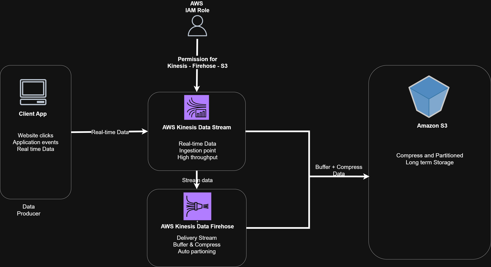

# 🚀 Kinesis to S3 and Long-Term Archiving

This project demonstrates a **real-time data ingestion and archiving pipeline** using **Amazon Kinesis, Firehose, and S3**.  
The goal is to continuously capture streaming events (like website clicks or application logs), process them in real-time, and archive them in **Amazon S3** in a compressed, partitioned format for **long-term storage and analytics**.

---

## 📌 Problem Statement
Modern applications generate **huge amounts of real-time data** such as:
- Website clickstreams
- Application usage logs
- IoT sensor data

Without a robust pipeline, managing, storing, and analyzing this data becomes difficult and costly.  
This project provides a **scalable, secure, and cost-efficient solution** for real-time data ingestion and long-term archiving.

---

## 🎯 Solution Overview
The pipeline works as follows:
1. **Client Application** generates real-time events.
2. **Amazon Kinesis Data Streams** ingests these events.
3. **Amazon Kinesis Data Firehose** buffers, compresses, and partitions the data.
4. **Amazon S3** stores the data in a **partitioned (Year/Month/Day/Hour)** and compressed format.
5. **AWS IAM** ensures secure access between services.

---

## 🏗️ Architecture




## 🛠️ AWS Services Used
| Service                        | Role in Project |
|--------------------------------|-----------------|
| **Amazon Kinesis Data Streams** | Ingest raw event data in real-time |
| **Amazon Kinesis Data Firehose** | Buffer, compress, and deliver data into S3 |
| **Amazon S3**                   | Cost-effective, durable, long-term storage |
| **AWS IAM**                     | Provides secure access and permissions |

---

## 📂 Project Structure
```
.
├── data_producer.py         # Python script to generate and send events to Kinesis
├── Kinesis_S3.drawio        # Architecture diagram (editable in diagrams.net)
├── Kinesis to S3.pdf        # Detailed project documentation
└── README.md                # This file
```

---

## ⚙️ Setup Instructions

### 1. Prerequisites
- AWS account with permissions for **Kinesis, Firehose, and S3**
- Python 3.8+
- AWS CLI configured (`aws configure`)
- Install Python dependencies:
  ```bash
  pip install boto3 faker
  ```

### 2. Create AWS Resources
1. **S3 Bucket**  
   Create a bucket named: `kinesis-archive-data-<yourname>`

2. **Kinesis Data Stream**  
   ```bash
   aws kinesis create-stream --stream-name website-events-stream --shard-count 1
   ```

3. **IAM Role**  
   Create an IAM role with policies for:
   - `kinesis:GetRecords`
   - `s3:PutObject`

4. **Kinesis Firehose**  
   Configure a delivery stream that:
   - Reads from `website-events-stream`
   - Buffers data (5MB or 300 sec)
   - Compresses (GZIP/Parquet)
   - Delivers into your S3 bucket partitioned by **Year/Month/Day/Hour**

---

## 💻 Running the Data Producer

Run the Python script to generate events and push them to Kinesis:

```bash
python data_producer.py
```

Sample event generated:
```json
{
        'event_id': fake.uuid4(),
        'timestamp': datetime.utcnow().isoformat(),
        'event_type': random.choice(event_types),
        'user_id': fake.uuid4(),
        'session_id': fake.uuid4(),
        'page_url': fake.url(),
        'user_agent': fake.user_agent(),
        'ip_address': fake.ipv4(),
        'country': fake.country_code(),
        'device_type': random.choice(['desktop', 'mobile', 'tablet']),
        'browser': random.choice(['Chrome', 'Firefox', 'Safari', 'Edge']),
        'referrer': fake.url() if random.random() > 0.3 else None,
        'value': round(random.uniform(0, 1000), 2) if random.random() > 0.7 else None
    }
```

---

## 📊 Output in S3
Once Firehose delivers the data, you will see compressed, partitioned files in S3:

```
s3://kinesis-archive-data-rishikesh/
  └── year=2025/
      └── month=08/
          └── day=24/
              └── hour=12/
                  └── datafile.gz
```

---

## 🌟 Benefits
- **Scalable** – Handles high-volume real-time data.
- **Cost-efficient** – Uses compression and S3’s storage tiers.
- **Secure** – Managed via IAM roles and policies.
- **Analytics-ready** – Partitioned data can be queried via Athena/Glue.

---

## 🔮 Future Enhancements
- Add **AWS Glue** to catalog S3 data into tables.
- Use **Amazon Athena** to query archived data using SQL.
- Build **dashboards in Amazon QuickSight** for real-time visualization.

---

## 📘 Documentation
For a detailed explanation, refer to the full documentation:  
📄 [Kinesis to S3.pdf](Kinesis%20to%20S3.pdf)

---

## 🙏 Acknowledgements
- [AWS Kinesis Documentation](https://docs.aws.amazon.com/kinesis/)  
- [Amazon S3 Documentation](https://docs.aws.amazon.com/s3/)  
- [Faker Python Library](https://faker.readthedocs.io/)
